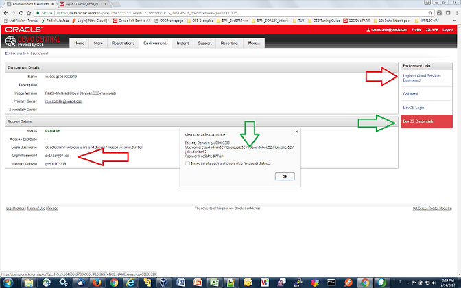

#### BEFORE YOU START

You will use two different identity domains during the labs. One for *Development Cloud Service* (DevCS) which holds the project and one for *Application Container Cloud Service* (ACCS) which is the deployment target and runs the application(s). So first please collect the following account information:

+ DevCS Identity domain (referred as **DEVCS_DOMAIN**) 
+ DevCS User(s) (**DEVCS_USER**) - *cloud.adminXX*
+ DevCS Password (**DEVCS_PWD**) - belongs to *cloud.adminXX*
+ ACCS Identity domain (**ACCS_DOMAIN**)
+ ACCS User(s) (**ACCS_USER**) - *cloud.admin*
+ ACCS Password (**ACCS_PWD**) - belongs to *cloud.admin* 

The diagram below shows how to find DevCS domain (GREEN ARROW) and ACCS domain (RED ARROW)

----
## IMPORTANT: How to prepare for this workshop
        
***Configure your Client Environment***
- Your client enviroment **must be configured prior** to attempting the Hands-on-Workshop labs. 
- You need to  install Virtual Box and [download](https://publicdocs-corp.documents.us2.oraclecloud.com/documents/link/LFA6E9C5DD9A6A3B91918DD4F6C3FF17C1177E4725F3/folder/FA218231C01821A99BDADFCEF6C3FF17C1177E4725F3/_CloudNativeMicroservicesWorkshop/nameasc) ([alternative location](https://drive.google.com/drive/folders/0B0MXC4qaECO6RHBWMEttdW9fOVk)) and run a pre-configured **Virtual Box Image**.
- If YOU WORK BEHIND FIREWALL YOU MUST CONFIGURE PROXIES BASED ON THAT [CONFIGURE PROXY DOCUMENT](../common/proxy.settings.md). ***Please follow this instruction *** prior to attempting the Labs. 
      
## How to View the Lab Guides

- The Labguides are best viewed using the Workshop's [GitHub Pages Website URL](https://oracle-weblogic.github.io/cloud-native-XWeeks/cloud-native-devops/index.html) 

- Once you are viewing the Workshop's GitHub Pages website, you can see a list of Lab Guides at any time by clicking on the **Menu Icon**
      
- Visit the [Workshop Interactive Labguide](http://launch.oracle.com/?cloudnative) for a visual overview of the workshop content. 

## DevOps and Cloud Native Microservices Workshop

This Oracle Public Cloud DevOps Cloud Native Microservices workshop will walk you through the Software Development Lifecycle (SDLC) for a Cloud Native project, during which you will create and use several Microservices. During this workshop you will take on the role of 3 personae. As the first persona - the Project Manager - youwill create the projects, add tasks and features to be worked on, and assign tasks to developers.  The Project Manager will then start the initial sprint. The Java Developer persona will develop a new twitter feed service that will allow for retrieval and filtering of twitter data. The JavaScript Developer persona will develop a new Twitter Marketing UI that will display the twitter data to allow for analysis.  During the workshop, you will get exposure to Oracle Developer Cloud Service and Oracle Application Container Cloud Service.

## Workshop Details

**Reference the following Lab Guides by opening their Documentation Files:**

## Lab 100: Agile Project Management

**Documenation**: [CloudNative100.md](CloudNative100.md)

### Objectives

- Create Initial Project
    - Add Users to Project
- Create Product Issues
    - Create Issues for Twitter Feed Microservice
    - Create Issues for Twitter Feed Marketing UI
- Create Agile Board and initial Sprint
- Add Issues to Sprint

## Lab 200: Continuous Delivery of Java Microservices

**Documenation**: [CloudNative200.md](CloudNative200.md)

### Objectives

- Access Developer Cloud Service
- Import Code from external Git Repository
- Import Project into Eclipse
- Build and Deploy project using Developer Cloud Service and Oracle Application Container Cloud Service

## Lab 300: Cloud Native Rapid Javascript Devlopment with node.js

**Documenation**: [CloudNative300.md](CloudNative300.md)

### Objectives

- Access Developer Cloud Service
- Import Code from external Git Repository
- Import Project into Brackets
- Build and Deploy project using Developer Cloud Service and Oracle Application Container Cloud Service

## Lab 400:  Cloud Native Develper Cloud Service Administration

**Documenation**: [CloudNative400.md](CloudNative400.md)

### Objectives

- Access Developer Cloud Service
- Complete Sprint
- Run Backlog and Sprint Reports
- Review Administrative Tasks
